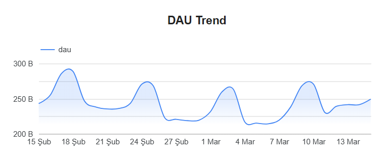
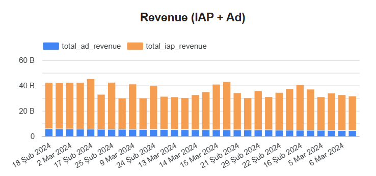
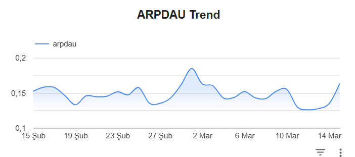
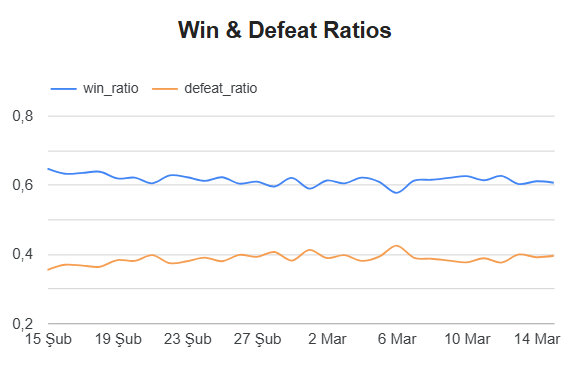
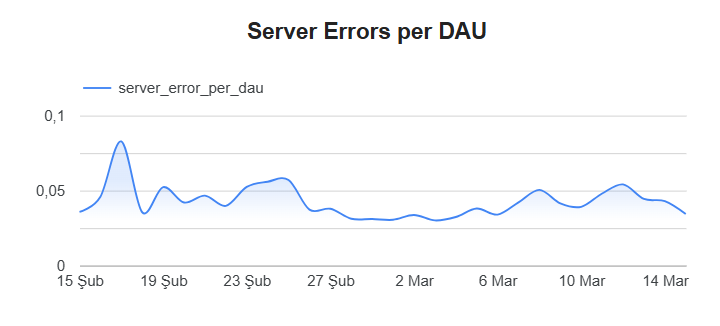
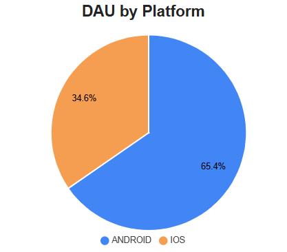
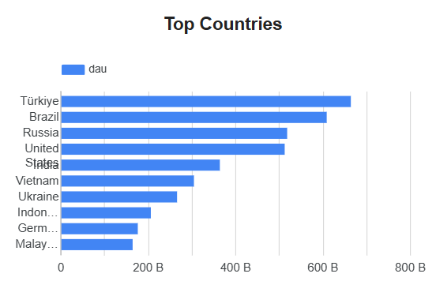

# Part 2 — DBT Model & Visualization

Aggregated daily game metrics model built with **dbt** on **BigQuery**, visualized with **Looker Studio**.

**Dashboard:** [Looker Studio — Daily Metrics Dashboard](https://lookerstudio.google.com/reporting/e5aed70b-1049-438c-9b89-bdface300fcf/page/oylqF?s=gl_doVbdUBY)

---

## Project Structure

```
dbt-analyse/
├── configs/
│   └── config.py                # GCP project settings
├── data/                        # Raw csv.gz files (not committed)
├── models/
│   ├── staging/
│   │   ├── src_raw.yml          # Source definition (BigQuery raw table)
│   │   └── stg_user_daily_metrics.sql  # Cleaning & deduplication
│   └── marts/
│       ├── daily_metrics.sql    # Aggregated business metrics
│       └── daily_metrics.yml    # Column tests & documentation
├── visualization/               # Dashboard screenshots
├── data_quality_check.py        # Pre-modeling data inspection script
├── upload_to_bq.py              # CSV → BigQuery upload script
├── dbt_project.yml              # dbt project configuration
├── profiles.yml                 # BigQuery connection profile
└── requirements.txt             # Python dependencies
```

---

## Approach

### 1. Data Quality Check

Before modeling, a Python script (`data_quality_check.py`) scans all `*.csv.gz` files and produces a read-only report. No data is modified at this stage.

| Check | Finding |
|-------|---------|
| Null values | `country` has 17,998 nulls (~0.0024%) |
| Duplicates (user_id + event_date) | 655 duplicate rows |
| match_end > match_start | 45,867 rows (matches can span across days) |
| Negative values | None |
| victory > match_end | None |

### 2. Data Pipeline

Raw CSV files are uploaded to BigQuery via `upload_to_bq.py`, then transformed through two dbt layers:

```
csv.gz files → BigQuery (raw_data.user_daily_metrics)
                        ↓
              stg_user_daily_metrics (view — cleaning)
                        ↓
              daily_metrics (table — aggregation)
                        ↓
              Looker Studio Dashboard
```

### 3. Staging Layer — `stg_user_daily_metrics`

Cleans and standardizes the raw data:

- **Platform normalization** — `UPPER(TRIM(platform))` ensures consistent values (e.g. `android` → `ANDROID`)
- **Null country handling** — null or empty country values mapped to `'UNKNOWN'`
- **Deduplication** — `ROW_NUMBER()` partitioned by `(user_id, event_date)`, keeping the row with highest `total_session_duration`
- **Null filtering** — rows with null `user_id` or `event_date` are excluded

### 4. Marts Layer — `daily_metrics`

Aggregated by `event_date`, `country`, and `platform`:

| Field | Logic |
|-------|-------|
| `dau` | `COUNT(DISTINCT user_id)` |
| `total_iap_revenue` | `SUM(iap_revenue)` |
| `total_ad_revenue` | `SUM(ad_revenue)` |
| `arpdau` | `(total_iap_revenue + total_ad_revenue) / dau` |
| `matches_started` | `SUM(match_start_count)` |
| `match_per_dau` | `matches_started / dau` |
| `win_ratio` | `SUM(victory_count) / SUM(match_end_count)` |
| `defeat_ratio` | `SUM(defeat_count) / SUM(match_end_count)` |
| `server_error_per_dau` | `SUM(server_connection_error) / dau` |

Division-by-zero is handled with BigQuery's `SAFE_DIVIDE()`.

### 5. dbt Tests

| Test | Scope |
|------|-------|
| `not_null` | `event_date`, `country`, `platform`, `dau` |
| `accepted_values` | `platform` must be `ANDROID` or `IOS` |
| `unique` (composite) | `event_date \| country \| platform` combination |

---

## Assumptions

1. A user is counted as "active" (DAU) if they have any row for that `event_date`.
2. Rows where `match_end > match_start` are kept — matches started on a previous day can end the next day.
3. Empty or null countries are mapped to `'UNKNOWN'` to preserve all activity data.
4. ARPDAU is calculated as `total_revenue / DAU` (population-level), not as the average of per-user revenues.

---

## Key Findings

### DAU Trend
DAU fluctuates between ~200K and ~300K with a recurring weekly pattern — peaks mid-week, dips on weekends.



### Revenue (IAP + Ad)
IAP revenue dominates total revenue. Ad revenue remains relatively stable across all days.



### ARPDAU
Average revenue per DAU hovers around $0.14–0.18, with a notable spike around early March.



### Win & Defeat Ratios
Win ratio sits steady around ~0.61, defeat ratio around ~0.39. The sum stays close to 1.0, indicating very few draws or disconnects.



### Server Errors per DAU
Server error rate peaked in mid-February (~0.08 per user) and has since trended downward to ~0.03, suggesting infrastructure improvements.



### DAU by Platform
Android accounts for 65.4% of DAU, iOS for 34.6%.



### Top Countries by DAU
Türkiye leads, followed by Brazil, Russia, and the United States.



---

## Visualization — Looker Studio

The interactive dashboard is built on Looker Studio (Google Data Studio) and connects directly to the `daily_metrics` BigQuery table.

**Dashboard link:** [https://lookerstudio.google.com/reporting/e5aed70b-1049-438c-9b89-bdface300fcf/page/oylqF?s=gl_doVbdUBY](https://lookerstudio.google.com/reporting/e5aed70b-1049-438c-9b89-bdface300fcf/page/oylqF?s=gl_doVbdUBY)

Dashboard includes filters for date range, country, and platform, along with the following charts:

- DAU trend (time series)
- Revenue breakdown (IAP vs Ad, stacked bar)
- ARPDAU trend
- Win/defeat ratio over time
- Server errors per DAU
- DAU split by platform (pie chart)
- Top countries by total DAU (horizontal bar)

---

## How to Run

### Prerequisites

- Python 3.10+
- Google Cloud SDK (`gcloud`) authenticated
- A GCP project with BigQuery enabled

### 1. Install Dependencies

```bash
pip install -r requirements.txt
```

### 2. Data Quality Check (optional)

```bash
# Place all csv.gz files in data/
python data_quality_check.py
```

### 3. Upload Raw Data to BigQuery

```bash
gcloud auth login
gcloud auth application-default login

export GCP_PROJECT_ID=<YOUR_PROJECT_ID>
python upload_to_bq.py
```

This creates the `raw_data.user_daily_metrics` table in BigQuery.

### 4. Run dbt Models

```bash
export GCP_PROJECT_ID=<YOUR_PROJECT_ID>
dbt run
dbt test
```

This builds `stg_user_daily_metrics` (view) and `daily_metrics` (table) in the `games_analyse_dev` dataset.
